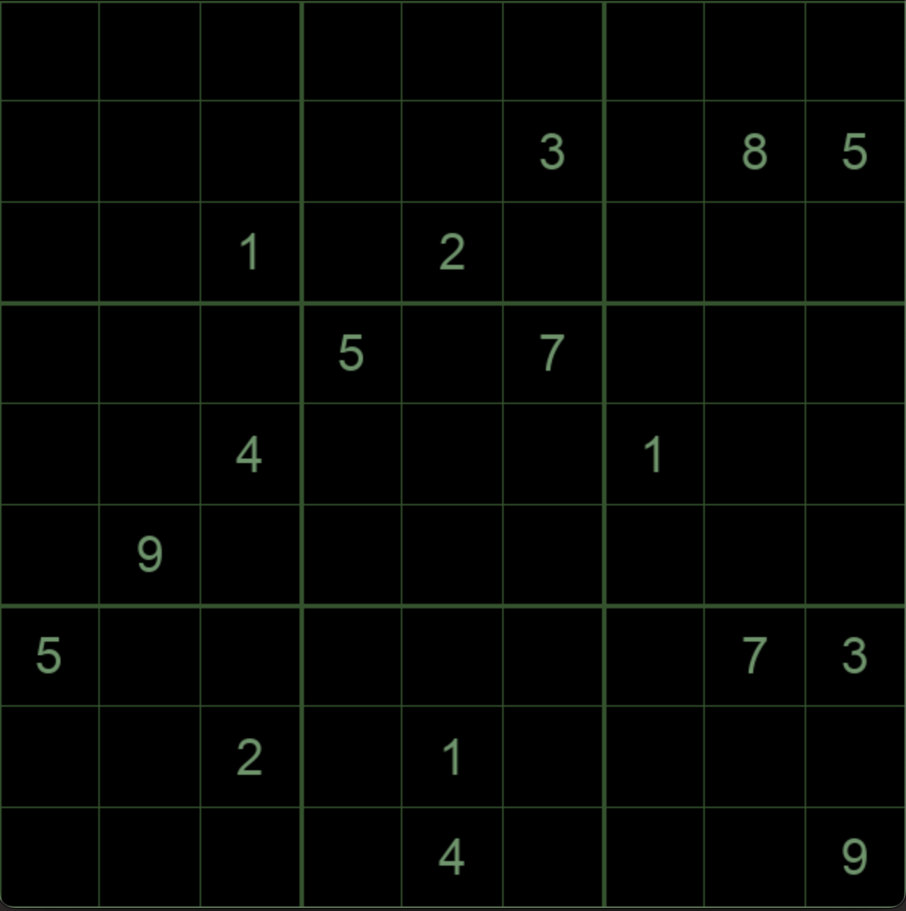

In my Junior year as a Computer Science student, I became fascinated with Sudoku Puzzles. This is my attempt at applying Dancing Links to the famous Sudoku problem.

# Sudoku PyGame

# Resources

## Animations
- [DLX Animation](https://playwithalgos.github.io/dancing-links/)
- [Sudoku Visualizer](https://nstagman.github.io/algx_visualizer/)

## Repositories
- [Sudoku GitHub to Animation](https://github.com/nstagman/exact_cover_sudoku/blob/master/README.md)

## Wikis
- [Exact Cover](https://en.wikipedia.org/wiki/Exact_cover#cite_note-8)
- [Algorithm X](https://en.wikipedia.org/wiki/Knuth%27s_Algorithm_X)

